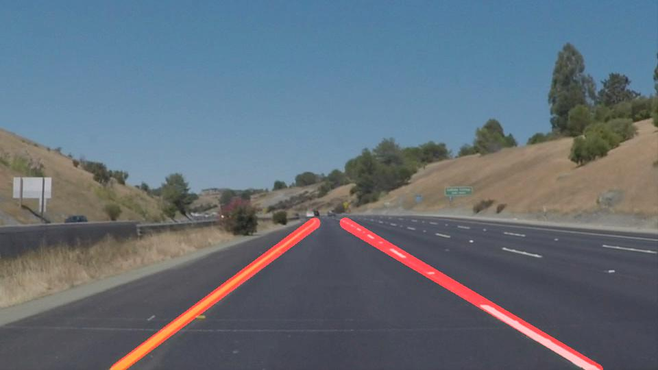

# Finding-Lane-Lines-Udacity
Finding lane lines on the road - Project1 for Self-Driving Cars Nanodegree @Udacity
---

## Overview
This project provides an implementation of lane lines identification on the road using an image processing pipeline.

This is my first project submission as part of Self-driving cars Nanodegree @Udacity.

The main entry points :
- [P1.ipynb](./P1.ipynb) : Jupyter notebook with full step by step implementation of the pipeline and testing on images & videos.

- [writeup.md](./writeup.md) : Writeup describing the pipeline and explaining the solution approach, as well as some reflection of what might not work well and some improvement ideas.

[](https://youtu.be/fQcbhDkMrZE)
---
## Quick Setup
#### 1. Install [Anaconda](https://www.anaconda.com/distribution/) or [Miniconda](https://docs.conda.io/en/latest/miniconda.html)

#### 2. Create a virtual env for the project
```
conda env create -f environment.yml
```
#### 3. Activate & Open the Jupyter notebook
```
source activate carnd-term1
```
#### 4. Open Jupyter notebook
```
jupyter notebook P1.ipynb
```
---
## License
This project is under [MIT License](./LICENSE).
